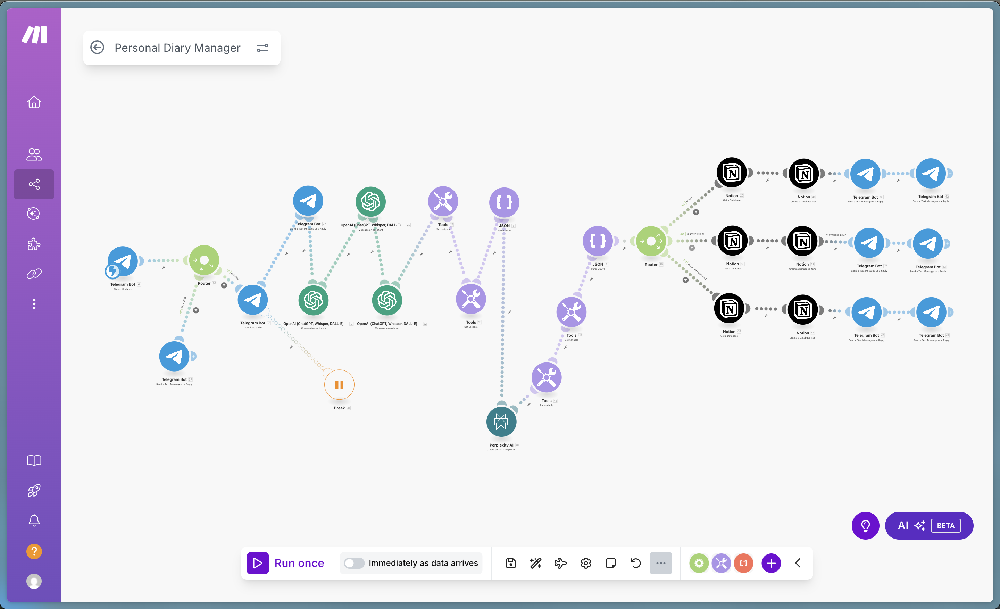

# 🎙️ AI Diary - Personal Voice Journal Automation



## ✨ Transform Your Voice into Organized Diary Entries in Minutes

**AI Diary** is a powerful n8n workflow that revolutionizes personal journaling by converting your voice recordings into beautifully formatted diary entries. Simply send a voice message to your Telegram bot, and watch as AI transforms your thoughts into structured, readable text.

## 🚀 Key Benefits

### ⏰ **Massive Time Savings**

- **Before**: 30-60 minutes writing detailed diary entries
- **After**: Just 2-3 minutes recording your voice
- **Time Saved**: Up to 95% reduction in journaling time

### 🎯 **Effortless Process**

1. **Record** - Send a voice message to your Telegram bot (any length)
2. **Relax** - AI automatically processes your audio
3. **Receive** - Get a perfectly formatted diary entry back

### 🧠 **AI-Powered Intelligence**

- **Smart Transcription**: Uses OpenAI Whisper for accurate speech-to-text
- **Content Enhancement**: AI cleans up filler words and improves readability
- **Language Support**: Optimized for Ukrainian language processing
- **Context Awareness**: Maintains the natural flow of your thoughts

## 🔧 How It Works

### Workflow Architecture

The AI Diary workflow consists of several intelligent components:

```
Telegram Voice Message → Audio Processing → AI Transcription → Content Enhancement → Formatted Response
```

#### 🎯 **Step-by-Step Process**

1. **Voice Input Detection**

   - Telegram webhook listens for voice messages
   - Automatically downloads audio files
   - Validates audio format and quality

2. **AI Transcription**

   - OpenAI Whisper converts speech to text
   - Removes unnecessary sounds and filler words
   - Handles Ukrainian language nuances

3. **Content Enhancement**

   - AI assistant improves text structure
   - Removes thinking sounds ("Ааа...", "А далі...")
   - Cleans up triple dots and hesitations

4. **Formatted Output**
   - Returns clean, readable diary entry
   - Maintains your personal voice and style
   - Ready for immediate use or further editing

## 💡 Perfect For

- **Busy Professionals** who want to maintain a personal journal without time commitment
- **Commuters** who can record thoughts while traveling
- **Anyone** who finds writing time-consuming but loves reflecting on their day
- **Non-native Writers** who express themselves better verbally
- **People with Disabilities** who find typing challenging

## 🎯 Use Cases

### Daily Reflection

Record your thoughts about the day during your commute or before bed.

### Idea Capture

Quickly capture creative ideas, insights, or important thoughts on the go.

### Emotional Processing

Voice your feelings and receive them back in organized, readable format.

### Meeting Notes

Transform voice recordings of personal reflections into structured notes.

## 🛠️ Technical Features

- **Telegram Integration**: Seamless voice message handling
- **OpenAI Whisper**: State-of-the-art speech recognition
- **Smart Routing**: Handles different message types appropriately
- **Error Handling**: Robust error management and retry logic
- **Language Optimization**: Specifically tuned for Ukrainian language
- **Automated Processing**: Zero manual intervention required

## 📊 Performance Metrics

| Metric            | Traditional Journaling      | AI Diary                  |
| ----------------- | --------------------------- | ------------------------- |
| Time Investment   | 30-60 minutes               | 2-3 minutes               |
| Effort Level      | High (writing, editing)     | Minimal (just talking)    |
| Consistency       | Often skipped               | Easy to maintain          |
| Accessibility     | Requires sitting, typing    | Works anywhere, anytime   |
| Language Barriers | Challenging for non-natives | Natural speech processing |

## 🎉 Success Stories

> _"I went from journaling once a week to daily entries. The AI Diary workflow saved me hours while helping me maintain better self-reflection habits."_

> _"As someone who thinks better out loud, this workflow is a game-changer. My voice messages become beautiful diary entries without any effort."_

## 🚀 Getting Started

1. **Set up n8n** with the provided workflow.json
2. **Configure Telegram Bot** and connect your webhook
3. **Add OpenAI API** credentials for Whisper and GPT
4. **Test** with a voice message
5. **Enjoy** effortless journaling!

## 🔒 Privacy & Security

- Voice messages are processed securely through OpenAI's API
- No permanent storage of audio files
- All data processing follows privacy best practices
- Your personal reflections remain private

## 🛡️ Requirements

- n8n instance (cloud or self-hosted)
- Telegram Bot Token
- OpenAI API Key (for Whisper and GPT)
- Basic n8n workflow configuration knowledge

## 📈 Future Enhancements

- Multi-language support expansion
- Integration with popular note-taking apps
- Sentiment analysis and mood tracking
- Voice command recognition for different entry types
- Automated categorization and tagging

---

**Transform your voice into organized thoughts. Start your AI-powered journaling journey today!** 🎙️✨

_Made with ❤️ using n8n, OpenAI, and Telegram_
